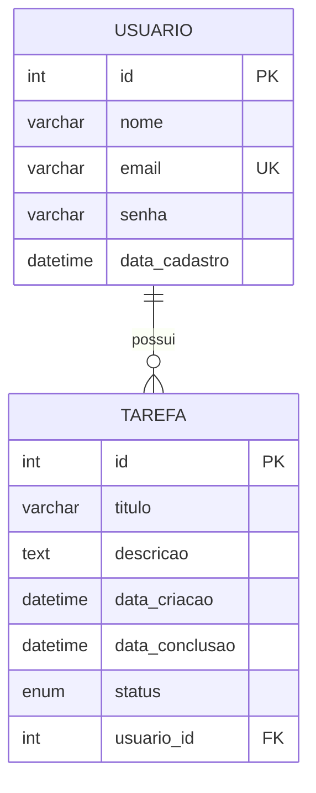

# Diagrama Entidade-Relacionamento — Gestão de Tarefas

## Entidades

- **USUARIO**: quem cria e possui as tarefas.
- **TAREFA**: a tarefa em si, sempre pertencente a um usuário.

## Relacionamento

Um usuário pode ter **N** tarefas, e cada tarefa pertence a **exatamente um** usuário
(relacionamento 1:N entre `usuario` e `tarefa`).

## Justificativa das colunas

| Tabela  | Coluna          | Motivo |
|---------|-----------------|--------|
| usuario | email UK        | evita usuários duplicados, usado como login |
| tarefa  | data_criacao    | preenchida automaticamente na criação (DEFAULT CURRENT_TIMESTAMP) |
| tarefa  | data_conclusao  | fica NULL até a tarefa ser concluída |
| tarefa  | status          | ENUM controlado ('pendente', 'em_andamento', 'concluida') em vez de texto livre |
| tarefa  | usuario_id FK   | garante que toda tarefa tenha um dono, com ON DELETE CASCADE |