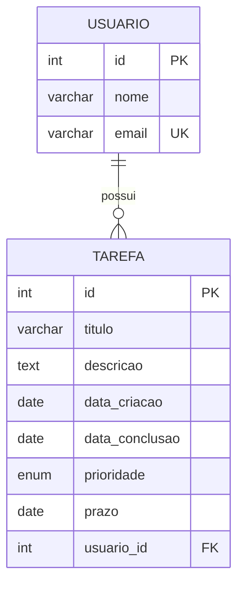

# Gerenciador de Tarefas

Sistema de linha de comando pra gerenciar tarefas e usuários, com os dados salvos em um banco MySQL.

Feito durante o curso Programação em Inglês, como parte dos desafios práticos.

## O que faz

Dá pra criar usuários e tarefas, vincular uma tarefa a um usuário, definir prioridade e prazo, marcar como concluída, editar ou excluir. Tudo pelo terminal, com um menu numerado.

Algumas coisas que tratei com mais cuidado:

- Não deixa criar tarefa pra um usuário que não existe
- Não deixa cadastrar dois usuários com o mesmo email
- Valida o formato do email antes de salvar
- Valida o formato da data do prazo (evita erro feio do banco se a pessoa digitar errado)
- Pede confirmação antes de excluir uma tarefa

## Estrutura

```
desafio4/
├── main.py        -> menu e interação com quem usa o programa
├── tarefas.py      -> tudo relacionado a criar/editar/listar/excluir tarefa
├── usuarios.py      -> mesma coisa, mas pra usuário
├── db.py          -> conexão com o banco
└── .env            -> senha do banco (não vai pro Git)
```

Separei assim pra não misturar a lógica do banco com a parte que conversa com o usuário no terminal.

## Modelagem

O modelo é simples: um usuário pode ter várias tarefas, e cada tarefa pertence a um único usuário (relação 1:N).



`usuario_id` em `tarefa` é a chave estrangeira que garante essa ligação — foi justamente essa constraint que me deu o erro lá no começo, quando eu tentava criar tarefa com um ID de usuário que não existia.

## Banco de dados

Duas tabelas, uma tarefa pertence a um usuário:

```sql
CREATE TABLE usuario (
    id INT AUTO_INCREMENT PRIMARY KEY,
    nome VARCHAR(100) NOT NULL,
    email VARCHAR(100) NOT NULL UNIQUE
);

CREATE TABLE tarefa (
    id INT AUTO_INCREMENT PRIMARY KEY,
    titulo VARCHAR(100) NOT NULL,
    descricao TEXT,
    data_criacao DATE NOT NULL,
    data_conclusao DATE,
    prioridade ENUM('baixa', 'media', 'alta') DEFAULT 'media',
    prazo DATE,
    usuario_id INT NOT NULL,
    FOREIGN KEY (usuario_id) REFERENCES usuario(id)
);
```

## Rodando localmente

Clonar o repositório e entrar na pasta:
```bash
git clone https://github.com/anonimaestaly/teslando.git
cd teslando/desafio4
```

Criar o ambiente virtual e instalar as dependências:
```bash
python -m venv .venv
.venv\Scripts\Activate.ps1    # Windows
pip install -r requirements.txt
```

Criar as tabelas no MySQL (script acima) e depois criar um arquivo `.env` na pasta com:
```
DB_HOST=127.0.0.1
DB_PORT=3306
DB_USER=root
DB_PASSWORD=sua_senha
DB_NAME=meu_banco
```

Rodar:
```bash
python main.py
```

## Menu

```
--- TAREFAS ---
1 - Nova tarefa
2 - Ver tarefas
3 - Editar tarefa
4 - Concluir tarefa
5 - Excluir tarefa
8 - Ver tarefas de um usuario

--- USUARIOS ---
6 - Novo usuario
7 - Ver usuarios

0 - Sair
```

## Dificuldades que encontrei

Logo no começo apanhei bastante de um erro de foreign key: eu tentava criar uma tarefa com um `usuario_id` que não existia na tabela `usuario`, e o MySQL recusava com um traceback gigante. Levei um tempo pra entender que o problema não era o número em si, era que eu nunca tinha criado usuário nenhum — daí que veio a ideia de mostrar a lista de usuários antes de pedir o ID, pra não ficar adivinhando.

Também tive um perrengue com o próprio arquivo `main.py`: em algum momento ao editar ele ficou cortado no meio (faltando a função do menu inteira), e o programa rodava sem erro nenhum, só que sem fazer nada — porque o `if __name__ == "__main__"` tinha sumido junto. Foi só olhando o conteúdo salvo linha por linha que percebi.

## O que eu quis praticar aqui

Esse desafio foi uma boa desculpa pra sair do CRUD mais básico e mexer com coisas que aparecem em projeto de verdade: relacionar duas tabelas com foreign key, tratar erro do banco sem deixar o traceback estourar na cara de quem usa, e tirar senha do código (usando `.env`). Também refatorei a conexão com o banco pra usar um context manager (`with`) e não repetir o mesmo bloco de abrir/fechar cursor em toda função.