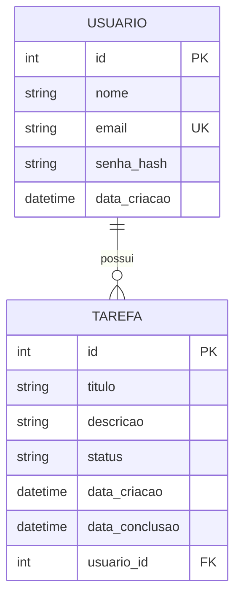

# Modelagem do banco — Gestão de Tarefas

Pra esse desafio, pensei em duas coisas que precisavam existir no sistema: quem usa
o app (o usuário) e o que essa pessoa quer organizar (a tarefa). A partir disso,
defini duas tabelas.

## Usuário

Cada usuário tem um id (gerado automaticamente), nome, email e uma senha (guardada
como hash, nunca em texto puro — isso é uma prática básica de segurança). O email
é único, pra não deixar duas pessoas se cadastrarem com o mesmo email.

- id — chave primária, autoincremento
- nome — obrigatório
- email — obrigatório e único
- senha_hash — obrigatório
- data_criacao — preenchida automaticamente quando o usuário é criado

## Tarefa

Cada tarefa pertence a um usuário e tem um título, uma descrição (opcional), um
status e as datas de criação e conclusão.

- id — chave primária, autoincremento
- titulo — obrigatório
- descricao — opcional
- status — só pode ser 'pendente', 'em_andamento' ou 'concluida' (começa como
  'pendente')
- data_criacao — preenchida automaticamente
- data_conclusao — só existe quando a tarefa está concluída
- usuario_id — de quem é a tarefa (chave estrangeira pra usuario.id)

## Como as duas se relacionam

Um usuário pode ter várias tarefas, mas cada tarefa é de um único usuário —
relacionamento 1:N. Configurei pra que, se um usuário for excluído, todas as
tarefas dele sejam excluídas junto (ON DELETE CASCADE), pra não sobrar tarefa
"solta" sem dono no banco.

## Diagrama

## Algumas decisões que tomei ao modelar

- Coloquei um `CHECK` no status pra o banco não aceitar nenhum valor fora dos
  três permitidos, mesmo que algum bug no código tentasse inserir outra coisa.
- Também coloquei um `CHECK` garantindo que `data_conclusao` só pode estar
  preenchida quando o status é 'concluida' — assim não corro o risco de ter uma
  tarefa marcada como pendente mas com data de conclusão registrada.
- Criei um índice em `usuario_id` na tabela tarefa, pra deixar mais rápida a
  busca de "todas as tarefas de um usuário", que é a consulta mais comum do
  sistema.