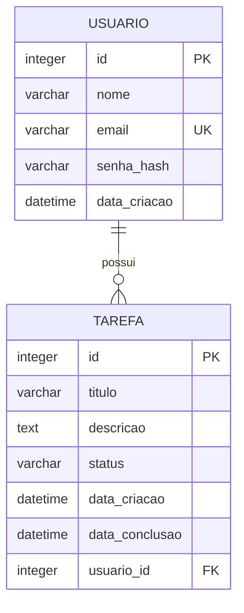

# Modelagem — Gestão de Tarefas

Modelagem do banco de dados da aplicação de gestão de tarefas: entidades,
atributos, relacionamento e diagrama entidade-relacionamento (ER).

---

## 1. Entidades e atributos

### 1.1 `usuario`

Representa cada pessoa que utiliza o sistema e pode criar suas próprias tarefas.

| Atributo       | Tipo          | Restrições                            |
|----------------|---------------|-----------------------------------------|
| `id`           | INTEGER       | Chave primária, autoincremento          |
| `nome`         | VARCHAR(100)  | Obrigatório                             |
| `email`        | VARCHAR(150)  | Obrigatório, único                      |
| `senha_hash`   | VARCHAR(255)  | Obrigatório                             |
| `data_criacao` | DATETIME      | Obrigatório, padrão: data/hora atual    |

### 1.2 `tarefa`

Representa uma tarefa criada por um usuário, com título, descrição e status de andamento.

| Atributo         | Tipo         | Restrições                                                                                    |
|------------------|--------------|--------------------------------------------------------------------------------------------------|
| `id`             | INTEGER      | Chave primária, autoincremento                                                                   |
| `titulo`         | VARCHAR(150) | Obrigatório                                                                                       |
| `descricao`      | TEXT         | Opcional                                                                                          |
| `status`         | VARCHAR(20)  | Obrigatório, padrão `'pendente'` — valores possíveis: `pendente`, `em_andamento`, `concluida`     |
| `data_criacao`   | DATETIME     | Obrigatório, padrão: data/hora atual                                                              |
| `data_conclusao` | DATETIME     | Opcional — só pode ser preenchida quando `status = 'concluida'`                                   |
| `usuario_id`     | INTEGER      | Obrigatório — chave estrangeira para `usuario.id`                                                 |

---

## 2. Relacionamento

| Entidade A | Cardinalidade | Entidade B | Regra ao excluir |
|------------|:--------------:|------------|-------------------|
| `usuario`  | 1 — N           | `tarefa`   | `ON DELETE CASCADE` |

Um `usuario` pode ter **N** tarefas, e cada `tarefa` pertence a exatamente **um** `usuario`. Ao excluir um usuário, todas as suas tarefas são excluídas automaticamente em cascata.

---

## 3. Diagrama entidade-relacionamento

---

## 4. Regras de negócio aplicadas na modelagem

| Regra | Onde é garantida |
|-------|-------------------|
| `email` único por usuário — evita cadastros duplicados | Constraint `UNIQUE` |
| `status` só aceita `pendente`, `em_andamento` ou `concluida` | Constraint `CHECK` |
| `data_conclusao` só existe quando `status = 'concluida'` | Constraint `CHECK` |
| Exclusão de usuário remove suas tarefas automaticamente, evitando tarefas órfãs | `ON DELETE CASCADE` |